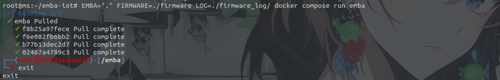
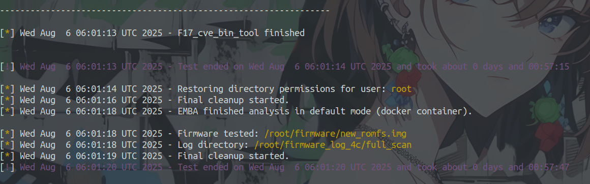
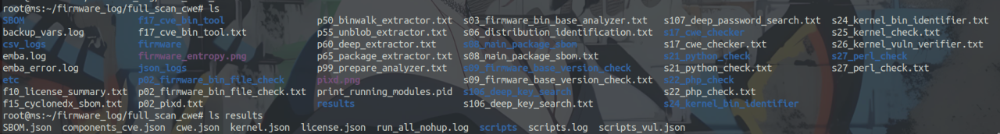

# 🔍 EMBA-IOT - 固件供应链安全检测平台

> **基于 EMBA 的智能固件安全分析工具** 🚀

该项目改编自 [EMBA](https://github.com/e-m-b-a/emba)，专门用于检测固件的供应链安全。目前支持对未加密固件及部分厂商加密固件的解包、扫描固件组件、检测组件关联 CVE、检测固件中的二进制程序与脚本文件的安全漏洞、识别固件包含的许可证，以及识别密钥字符并对部分识别到的密码进行爆破。

## 🛠️ 环境要求

### 支持的操作系统
- Ubuntu 22.04 / Ubuntu 24.04
- Kali Linux

### 前置依赖
- Docker
- Docker Compose
- Git

> ⚠️ **重要提示**
> 
> 安装前请确保已正确安装 Docker 和 Docker Compose，并配置好镜像源。建议为 Git 配置代理以加速下载。

## 📦 安装指南

### 1. 克隆项目
```bash
git clone https://github.com/starrysky1004/emba-iot.git
cd emba-iot
```

### 2. 安装 EMBA
```bash
sudo ./installer -D
```

> 💡 **说明**：安装过程可能会中途报错退出，但这不影响配置文件中的模块正常运行。

### 3. 创建必要目录
```bash
# 创建固件存储目录（路径可自定义）
mkdir ~/firmware

# 创建日志存储目录（路径可自定义）
mkdir ~/log

# 创建 EMBA Docker 临时目录（必须使用此名称）
cd emba-iot
mkdir firmware_log
```

> ⚠️ **重要**：`firmware_log` 目录名称必须保持默认，因为 EMBA 使用 Docker 运行前需要保证该目录为空，且项目已添加自动清理 `firmware_log` 目录功能。

### 4. 构建 Docker 镜像
```bash
EMBA="." FIRMWARE=./firmware LOG=./firmware_log/ docker compose run emba
```

> ⏱️ **注意**：构建过程耗时较长，请耐心等待。完成后可直接退出，后续使用时会自动在 Docker 中运行。



## 🚀 使用方法

### 项目结构概览

```
emba-iot/
├── 📁 firmware/          # Docker 临时固件存储
├── 📁 firmware_log/      # Docker 临时结果存储
├── 📁 modules/           # 核心分析模块源码
├── 📁 output/            # 结果转换脚本
│   └── 📁 vulnerability_reports/  # 漏洞类型中文说明
├── 📁 scan-profiles/     # 扫描配置文件
├── 📄 emba              # 主程序脚本
├── 📄 installer.sh      # 安装程序
└── 📁 installer/        # 安装程序目录
```

### 基本使用命令

```bash
./emba -f ~/firmware/firmware_name -l ~/log/log_dirname -p ./scan-profiles/profile
```

**参数说明**：

- `-f`：固件文件路径（存放到 `~/firmware/` 目录中）
- `-l`：日志和结果目录名称（**每次必须使用不同的名称**，建议使用时间+固件名或随机字符串）
- `-p`：扫描配置文件路径
- -c：指定 full_scan.emba 或需要使用 cwe 模块检测二进制程序漏洞时需要加上此选项

### 运行示例



### 结果查看

检测完成后，重点关注 `log/results/` 目录中生成的 JSON 文件：



## 📋 扫描模式详解

### 🔍 扫描配置文件对比

| 功能特性 | quick_sbom | sbom_link_cve | quick_scan | full_scan |
|---------|------------|---------------|------------|-----------|
| 🔧 组件扫描 | ✅ | ✅ | ✅ | ✅ |
| 📜 许可证扫描 | ✅ | ✅ | ✅ | ✅ |
| 🛡️ 组件关联 CVE | ❌ | ✅ | ✅ | ✅ |
| 🐍 脚本漏洞检测 | ❌ | ❌ | ✅ | ✅ |
| 🔍 二进制程序漏洞检测 | ❌ | ❌ | ❌ | ✅ |
| 🖥️ 内核关联 CVE 识别与验证 | ❌ | ❌ | ❌ | ⚙️ 可选 |
| 🔐 密钥扫描和爆破 | ❌ | ❌ | ❌ | ⚙️ 可选 |

### 📊 详细功能说明

#### 1. 🔧 **quick_sbom.emba** - 基础组件扫描
识别固件相关组件和许可证，生成 SBOM 和许可证报告。

**输出文件**：
- `SBOM.json`：EMBA 自带的 SBOM 文件（不包含漏洞信息）
- `license.json`：组件许可证信息

#### 2. 🛡️ **sbom_link_cve.emba** - CVE 关联分析
在基础扫描基础上，识别固件组件关联的 CVE 漏洞。

**输出文件**：
- `components_cve.json`：组件关联的 CVE 漏洞详情

#### 3. 🐍 **quick_scan.emba** - 脚本安全检测
检测 Python、PHP、Perl 脚本中的安全漏洞。

**输出文件**：
- `scripts_vul.json`：脚本漏洞检测结果

#### 4. 🔍 **full_scan.emba** - 全面安全扫描
最全面的扫描模式，包含所有安全检测功能。

> ⚠️ **重要**：该模式需要在运行 emba 时添加 `-c` 选项！

**输出文件**：
- `cwe.json`：二进制程序漏洞检测
- `kernel.json`：内核相关 CVE 识别与验证
- `passwd.json`：密钥扫描和爆破结果

## 📈 性能基准测试

基于 35.66 MB 固件（解包后 217MB）的测试结果：

| 配置文件 | 配置环境 | 耗时 |
|---------|---------|------|
| **quick_sbom.emba** | 2c4G | 7min27s |
| | 4c4G | 25min34s |
| | 8c8G | 15min28s |
| | 16c16G | 8min19s |
| **sbom_link_cve.emba** | 2c4G | 27min57s |
| | 4c4G | 30min03s |
| | 8c8G | 17min52s |
| | 16c16G | 9min31s |
| **quick_scan.emba** | 2c4G | 29min32s |
| | 4c4G | 34min08s |
| | 8c8G | 20min03s |
| | 16c16G | 9min57s |
| **full_scan.emba** | 2c4G | 2h01min09s |
| | 4c4G | 57min47s |
| | 8c8G | 29min29s |
| | 16c16G | 12min44s |

## ⚙️ 配置文件定制

### 📝 可选配置参数

| 参数名 | 功能描述 | 示例值 |
|--------|----------|--------|
| `FORMAT_LOG` | 启用带颜色的日志格式 | `export FORMAT_LOG=0` |
| `THREADED` | 启用多线程处理 | `export THREADED=1` |
| `SHORT_PATH` | 日志中仅显示相对路径 | `export SHORT_PATH=0` |
| `HTML` | 生成 HTML 格式报告 | `export HTML=1` |
| `SILENT` | 启用静默模式 | `export SILENT=1` |
| `DISABLE_STATUS_BAR` | 禁用状态栏显示 | `export DISABLE_STATUS_BAR=0` |
| `DISABLE_NOTIFICATIONS` | 禁用桌面通知 | `export DISABLE_NOTIFICATIONS=1` |
| `DISABLE_DOTS` | 禁用状态点输出 | `export DISABLE_DOTS=1` |
| `QUICK_SCAN` | 启用快速扫描模式 | `export QUICK_SCAN=1` |
| `SBOM_MINIMAL` | 启用最小 SBOM 模式 | `export SBOM_MINIMAL=1` |
| `YARA` | 启用 YARA 规则扫描 | `export YARA=1` |
| `QEMULATION` | 启用 QEMU 用户模式模拟 | `export QEMULATION=1` |
| `FULL_EMULATION` | 启用全系统模拟 | `export FULL_EMULATION=1` |

### 🔧 模块选择配置

| 模块组 | 功能描述 | 生成文件 | 参考耗时 (2c4G) |
|--------|----------|----------|----------------|
| `"S03" "S06" "S08" "S09"` | 基础检测 | - | 11分9秒 |
| `"S21" "S22" "S27"` | 脚本漏洞检测 | scripts_vul.json | 5分48秒 |
| `"S24" "S25" "S26"` | 内核关联 CVE 识别与验证 | kernel.json | 1小时57分18秒 |
| `"S17"` | 二进制程序漏洞检测 | cwe.json | 51秒 |
| `"S106" "S107" "S108" "S109"` | 密钥检测与爆破 | passwd.json | 5分钟 |
| `"F10"` | 许可证检测 | license.json | 3秒 |
| `"F15"` | 生成 SBOM | SBOM.json | 22秒 |
| `"F17"` | 组件关联 CVE 检测 | components_cve.json | 3分25秒 |

### 📋 完整配置示例

```bash
# 基础配置
export FORMAT_LOG=0 
export THREADED=1  
export SHORT_PATH=0 
export HTML=0      
export DISABLE_DOTS=1  
export YARA=1   
export SBOM_MINIMAL=0
export DISABLE_DEEP=0  
export VEX_METRICS=1
export QEMULATION=1

# 模块选择
export SELECT_MODULES+=( "S03" "S06" "S08" "S09" )                 # 基础信息扫描
export SELECT_MODULES+=( "S21" "S22" "S27" )                       # 脚本漏洞检测
export SELECT_MODULES+=( "S24" "S25" "S26" )                       # 内核 CVE 检测
export SELECT_MODULES+=( "S17" )                                   # 二进制漏洞检测
export SELECT_MODULES+=( "S106" "S107" "S108" "S109" )             # 密钥检测爆破
export SELECT_MODULES+=( "F10" "F15" "F17" )                       # 许可证和 CVE 检测

# S08 子模块配置
export S08_MODULES_ARR=()
S08_MODULES_ARR=( "S08_submodule_debian_pkg_mgmt_parser" )
S08_MODULES_ARR+=( "S08_submodule_deb_package_parser" )
# ... 更多子模块配置
```

## 📄 输出文件格式

### 🔧 SBOM.json 格式
```json
{  
"$schema": "string",                    // JSON Schema 定义
  "bomFormat": "string",                  // BOM 格式版本
      "specVersion": "string",                // 规范版本
      "serialNumber": "string",               // 序列号
      "version": "int",                       // 版本号
      "metadata": {
        "timestamp": "string",                // 生成时间戳
        "tools": {
          "components": [...]                 // 工具组件信息
        },
        "component": {...},                   // 主组件信息
        "supplier": {...},                    // 供应商信息
        "lifecycles": [...]                   // 生命周期信息
      },
      "components": [
        {
          "type": "string",                   // 组件类型
          "name": "string",                   // 组件名称
          "version": "string",                // 组件版本
          "supplier": {...},                  // 供应商信息
          "group": "string",                  // 组件分组
      "bom-ref": "string",                // BOM 引用 ID
          "scope": "string",                  // 作用域
      "cpe": "string",                    // CPE 标识符
      "purl": "string",                   // 包 URL
          "properties": [...],                // 属性列表
          "hashes": [...]                     // 哈希值列表
        }
      ]
}
```

### 📜 license.json 格式
```json
{
  "metadata": {
    "total_components": "int",            // 总组件数量
    "total_licenses": "int",              // 总许可证类型数量
    "filtered_out_components": "int",     // 被过滤掉的组件数量
    "generated_at": "string|null"         // 生成时间戳
  },
  "components": [
    {
      "binary": "string",                 // 二进制文件名
      "product": "string",                // 产品名称
      "version": "string",                // 版本号
      "license": "string"                 // 许可证类型
    }
  ],
  "license_summary": {
    "license": {
      "count": "int",                     // 该许可证下的组件数量
      "components": [                     // 使用该许可证的组件列表
        {
          "binary": "string",             // 二进制文件名
          "product": "string",            // 产品名称
          "version": "string",            // 版本号
          "license": "string"             // 许可证类型
        }
      ]
    }
  }
}
```

### 🛡️ components_cve.json 格式
```json
{
  "total_components": "int",              // 总组件数量
  "total_vulnerabilities": "int",         // 总漏洞数量
  "severity_summary": {
    "critical": "int",                    // 严重级别漏洞数量
    "high": "int",                        // 高危级别漏洞数量
    "medium": "int",                      // 中危级别漏洞数量
    "low": "int"                          // 低危级别漏洞数量
  },
  "components": [
    {
      "component_name": "string",         // 组件名称
      "version": "string",                // 组件版本
      "total_vulnerabilities": "int",     // 该组件总漏洞数
      "severity_breakdown": {
        "critical": "int",                // 严重级别数量
        "high": "int",                    // 高危级别数量
        "medium": "int",                  // 中危级别数量
        "low": "int"                      // 低危级别数量
      },
      "vulnerabilities": [
        {
          "product": "string",            // 产品名称
          "version": "string",            // 版本号
      "cve_number": "string",         // CVE 编号
          "severity": "string",           // 严重程度
      "score": "float",               // CVSS 评分
          "source": "string",             // 数据来源
      "cvss_version": "string",       // CVSS 版本
      "cvss_vector": "string",        // CVSS 向量
          "remarks": "string"             // 备注信息
        }
      ]
    }
  ]
}
```

### 🐍 scripts_vul.json 格式
```json
{
  "scan_summary": {
"total_python_issues": "int",         // Python 脚本问题总数
"total_php_issues": "int",            // PHP 脚本问题总数
"total_perl_issues": "int",           // Perl 脚本问题总数
    "total_all_issues": "int"             // 所有脚本问题总数
  },
  "statistics": {
    "python": {
  "total_issues": "int",              // Python 问题总数
      "files_affected": "int"             // 受影响文件数
    },
    "php": {
  "total_issues": "int",              // PHP 问题总数
  "progpilot_issues": "int",          // Progpilot 检测问题数
      "files_affected": "int"             // 受影响文件数
    },
    "perl": {
  "total_issues": "int",              // Perl 问题总数
      "files_affected": "int"             // 受影响文件数
    }
  },
  "detailed_results": {
    "s21_python_check": {
      "total_issues": "int",              // 总问题数
      "issues": [
        {
          "file_name": "string",          // 文件名
          "line_number": "int",           // 行号
          "column_number": "int",         // 列号
          "error_code": "string",         // 错误代码
          "error_message": "string",      // 错误信息
          "severity": "string",           // 严重程度
          "confidence": "string"          // 置信度
        }
      ]
    },
    "s22_php_check": {
      "total_issues": "int",              // 总问题数
  "progpilot_issues": "int",          // Progpilot 检测问题数
      "issues": [
        {
          "file_name": "string",          // 文件名
          "line_number": "int",           // 行号
          "column_number": "int",         // 列号
          "error_code": "string",         // 错误代码
          "error_message": "string",      // 错误信息
          "vulnerability_type": "string", // 漏洞类型
          "code_snippet": "string",       // 代码片段
          "severity": "string"            // 严重程度
        }
      ]
    },
    "s27_perl_check": {
      "total_issues": "int",              // 总问题数
      "issues": [
        {
          "file_name": "string",          // 文件名
          "line_number": "int",           // 行号
          "error_code": "string",         // 错误代码
          "error_message": "string",      // 错误信息
          "code_snippet": "string",       // 代码片段
          "severity": "string"            // 严重程度
        }
      ]
    }
  }
}
```

### 🔍 cwe.json 格式
```json
{
  "scan_summary": {
    "total_high_risk_vulnerabilities": "int",  // 高风险漏洞总数
    "affected_binaries": "int",                // 受影响的二进制文件数
    "vulnerability_types": {
  "CWE code": "quantity"                   // CWE 代码及数量
    },
    "critical_count": "int",                   // 严重漏洞数量
    "binary_list": ["string"]                  // 二进制文件列表
  },
  "high_risk_vulnerabilities": [
    {
      "binary_file": "string",                 // 二进制文件名
      "vulnerability_type": "string",          // 漏洞类型
      "addresses": ["string"],                 // 内存地址列表
      "symbols": ["string"],                   // 符号列表
      "description": "string",                 // 漏洞描述
      "vulnerability_description": "string"    // 漏洞详细描述
    }
  ]
}
```

### 🔍 kernel.json 格式
```json
{
  "summary": {
    "total_vulnerabilities": 0,               // 总漏洞数量（s25 + s26 的总和）
    "verified_vulnerabilities": 0,            // 已验证的漏洞数量（仅来自 s26）
    "severity_distribution": {
      "Critical": 0,                          // 严重漏洞数量（仅来自 s26）
      "High": 0,                              // 高危漏洞数量（仅来自 s26）
      "Medium": 0,                            // 中危漏洞数量（仅来自 s26）
      "Low": 0,                               // 低危漏洞数量（仅来自 s26）
      "Unknown": 0                            // 未知严重程度漏洞数量（仅来自 s26）
    }
  },
  "kernel_analysis": {
    "kernel_version": "string",               // 内核版本（来自 s25）
    "kernel_modules": [
      {
        "path": "string",                     // 模块路径
        "license": "string",                  // 许可证类型
        "status": "string"                    // 模块状态
      }
    ],
    "statistics": {
      "version": "string",                    // 版本信息
      "total_modules": "int",                 // 总模块数
      "other_count": "int"                    // 其他模块数
    }
  },
  "s25_vulnerabilities": [
    {
      "cve_id": "string",                     // CVE 编号
      "description": "string",                // 漏洞描述
      "exposure": "string",                   // 暴露程度（probable/less probable/Unknown）
      "exploit_db": "string"                  // Exploit-DB 编号
    }
  ],
  "s26_vulnerabilities": [
    {
      "binary_name": "string",                // 二进制名称
      "version": "string",                    // 版本号
      "cve_id": "string",                     // CVE 编号
      "cvss_score": "string",                 // CVSS 评分
      "severity": "string",                   // 严重程度（Critical/High/Medium/Low/Unknown）
      "source": "string",                     // 数据来源
      "exploit_info": "string",               // 漏洞利用信息
      "verified": true/false                  // 是否已验证
    }
  ]
}
```

### 🔐 passwd.json 格式
```json
{
  "scan_summary": {
    "total_key_files": "int",                // 密钥文件总数
    "total_credentials": "int",              // 凭据总数
    "total_passwords_found": "int",          // 发现的密码总数
    "total_hashes_cracked": "int"            // 破解的哈希总数
  },
  "modules": {
    "s106_deep_key_search": {
      "total_files_with_keys": "int",        // 包含密钥的文件数
      "key_files": [
        {
          "file_path": "string",             // 文件路径
          "pattern": "string",               // 匹配模式
          "content_length": "int"            // 内容长度
        }
      ]
    },
    "s108_stacs_password_search": {
      "total_credentials": "int",            // 凭据总数
      "credentials": [
        {
          "path": "string",                  // 文件路径
          "hash": "string"                   // 密码哈希
        }
      ]
    },
    "s109_jtr_password_cracking": {
      "total_passwords_found": "int",        // 发现的密码数
      "total_hashes_cracked": "int",         // 破解的哈希数
      "found_passwords": ["string"],         // 发现的密码列表
      "cracked_passwords": ["string"]        // 破解的密码列表
    }
  }
}
```

## 🐛 故障排除

### 📋 常见问题

1. **安装过程中断**：即使安装过程报错退出，配置文件中的模块仍可正常运行
2. **Docker 构建失败**：检查 Docker 和 Docker Compose 是否正确安装
3. **权限问题**：确保有足够的权限创建目录和运行脚本

### 📝 日志文件

- `log/results/scripts.log`：output 脚本的详细日志文件，可用于故障诊断
